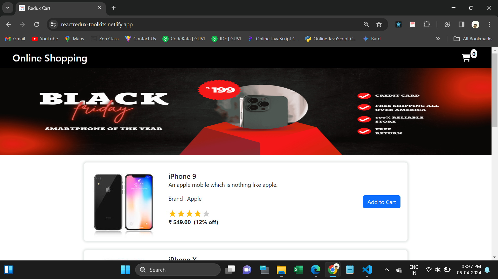
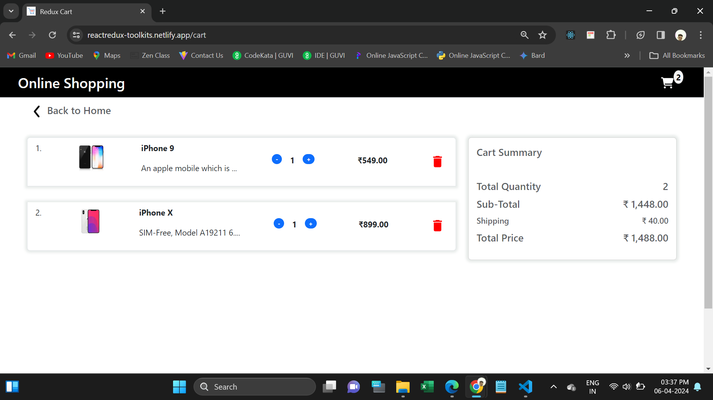

# React Redux

This webpage developed using React Redux.

Developed a cart page displaying per-item price, per-item quantity, total quantity, and total amount.

Implemented functionality to increase or decrease per-unit quantity, automatically updating total quantity and amount.

Utilized React Redux Toolkit exclusively for state management and necessary functions.

It's fully Responsive.

 
  <h4>Used Tools.</h4>
<ul>
  <li>Html</li>
  <li>CSS</li>
  <li>Bootstrap</li>
  <li>Javascript</li>
  <li>React JS</li>
  <li>Redux Toolkit</li>
</ul>
 
<h4>Npm Packages are used:</h4>
<ul>
  <li>https://www.npmjs.com/package/bootstrap</li>
  <li>https://www.npmjs.com/package/react-router-dom</li>
  <li>https://www.npmjs.com/package/redux</li>
 <li>https://www.npmjs.com/package/@reduxjs/toolkit</li>
  <li>https://www.npmjs.com/package/react-toastify</li>
  <li>https://www.npmjs.com/package/react-simple-star-rating</li>
  <li>https://www.npmjs.com/package/react-rating-stars-component</li>
</ul>
 
<h3>Deployed URL</h3>
https://reactredux-toolkits.netlify.app/cart
 

<h5>Screenshots</h5>
1. Home Page

2. Cart Page

